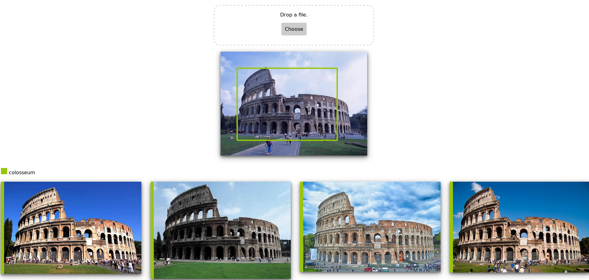

# SOR

Same Object Retrieval project for Computer Vision @ Sapienza/Computer-Science M.Sc

Reference Paper: [An Improved Faster R-CNN for Same Object Retrieval](https://ieeexplore.ieee.org/document/7986979)

## Tool



## [Slides](https://docs.google.com/presentation/d/131dm328uOeMdXZVKe87L_cg9ZjvruuswsrjVJDqtC2E/edit?usp=sharing)

## Instructions to run

* Clone the repository and create the following directories
    ```bash
    git clone https://github.com/Projectdotpy/SOR.git
    cd SOR
    mkdir data             # data folder containing the dataset
    mkdir model            # model folder containing the weights of the nn
    mkdir dist/query       # will contain the imgs given as query by the client
    cd dist
    ln -s ../data data     # needed to display the result in the browser
    cd ..
    ```

* Download `instre_monuments.zip` at this [link](https://drive.google.com/file/d/1gwN5qOGdxGFrUpJXX8QiEWHAw3BrShHW/view?usp=sharing). 
  This dataset is a subset of images from the [INSTRE](http://citeseerx.ist.psu.edu/viewdoc/download;jsessionid=597BFC482451728ED1C5F689F3458C7F?doi=10.1.1.709.9802&rep=rep1&type=pdf) dataset having only monuments. Move it under the `data` folder.

* Run `complex_data_transformation.sh` which will also run `create_csv.py`

    ```bash
    ./complex_data_transformation.sh
    ```

* Train the Network with the notebook present at this [link](https://colab.research.google.com/drive/1SKBuZs9TQkncj1lEZFhS0gnQUvXL8QYa).
  This step will create some files in drive namely `model_frcnn_vgg.hdf5`,
  `record.csv` and `model_vgg_config.pickle`

* Place the `model_frcnn_vgg.hdf5` and `record.csv` files under `model`

* Run `./convert_pickle.py` to modify the `model_vgg_config.pickle`
  ```bash
    ./convert_pickle.py
  ```

* Run `create_retrieval_db.py`. This may take a while
  ```bash
  ./create_retrieval_db.py # generates two files under retrieval_db
  ```

* Launch `server.py`
  ```bash
  ./server.py
  ```

* Browse to http://127.0.0.1:5000/index.html
